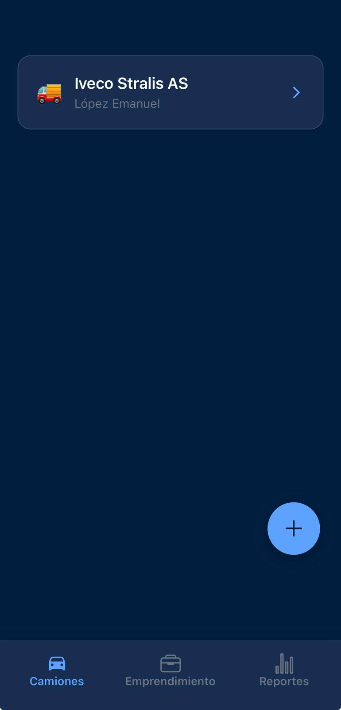
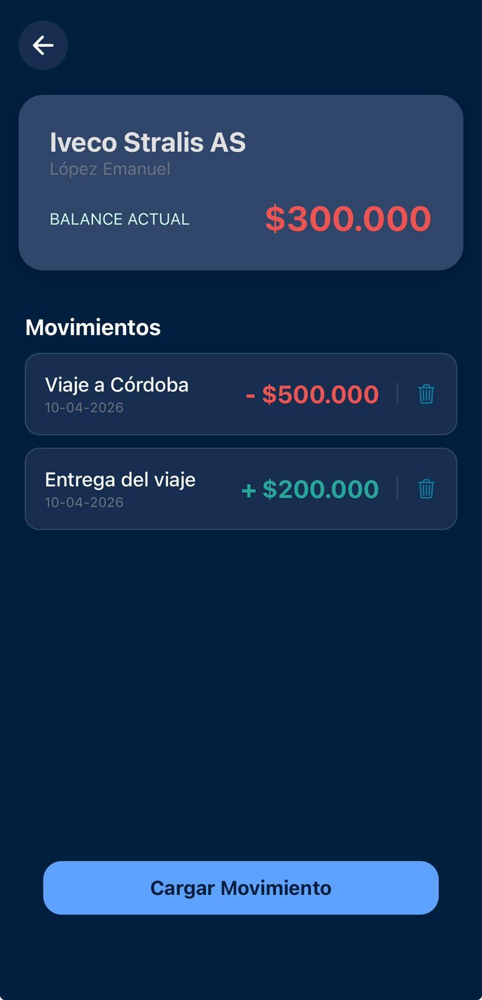
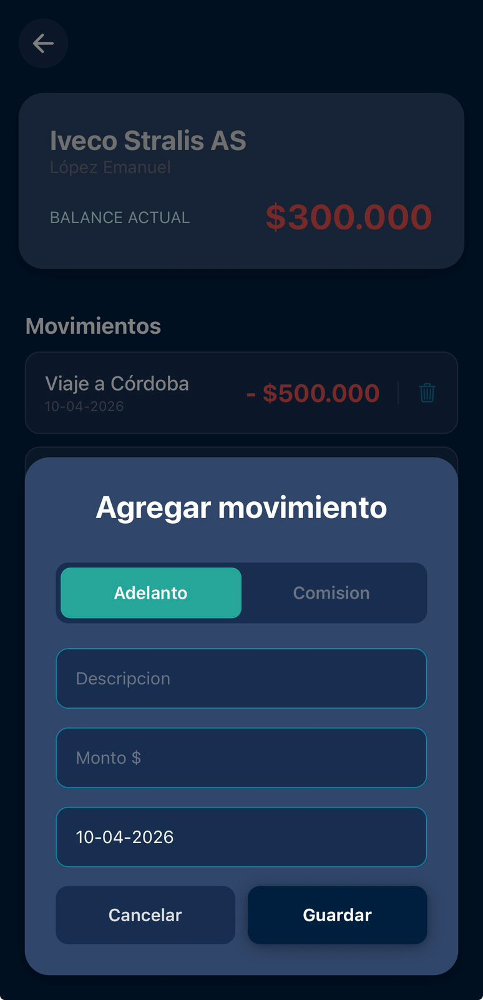
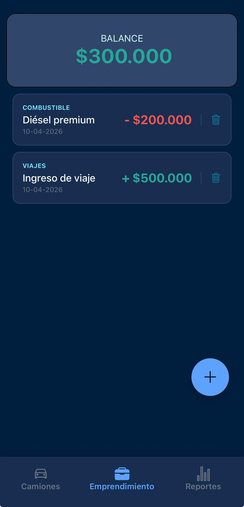
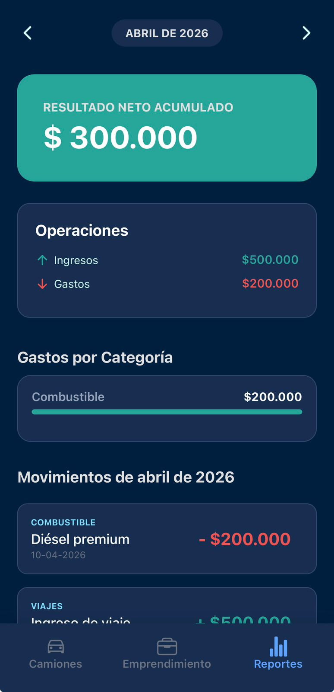

# 🚚 TruckApp — Gestión de Flota y Finanzas

Aplicación móvil construida con **React Native + Expo** para gestionar una flota de camiones, registrar movimientos financieros por vehículo y controlar las finanzas generales del emprendimiento.

---

## ✨ Funcionalidades

### 🚛 Gestión de Camiones

- Alta de camiones con modelo y conductor
- Eliminación con **swipe-to-delete** (deslizar para borrar) y confirmación
- Vista de detalle por camión con balance individual
- Registro de movimientos (adelantos, comisiones) por cada camión

### 💼 Gestión del Emprendimiento

- Registro de ingresos y gastos generales del negocio
- Categorización de movimientos (combustible, peajes, seguros, reparaciones, etc.)
- Balance general en tiempo real
- Eliminación de movimientos con confirmación

### 📊 Reportes Financieros

- Filtro por mes con navegación temporal
- Card de **Resultado Neto** mensual
- Resumen de ingresos vs. gastos
- Desglose de **gastos por categoría** con barras de porcentaje
- Listado detallado de movimientos del mes

---

## � Capturas de Pantalla

|                                                                    |                                                                    |                                                                    |
| :----------------------------------------------------------------: | :----------------------------------------------------------------: | :----------------------------------------------------------------: |
|  |  |  |
|  |  |                                                                    |

---

## �🛠️ Tech Stack

| Tecnología                       | Uso                                     |
| -------------------------------- | --------------------------------------- |
| **React Native**                 | Framework de UI multiplataforma         |
| **Expo SDK 54**                  | Entorno de desarrollo y build           |
| **Expo Router**                  | Navegación basada en file-system        |
| **TypeScript**                   | Tipado estático                         |
| **Supabase**                     | Base de datos PostgreSQL + API REST     |
| **TanStack Query**               | Data fetching, caching y sincronización |
| **React Hook Form + Zod**        | Formularios con validación tipada       |
| **React Native Gesture Handler** | Gestos nativos (swipe-to-delete)        |
| **React Native Reanimated**      | Animaciones fluidas a 60fps             |

---

## 📁 Estructura del Proyecto

```
truck-app/
├── app/                        # Pantallas (Expo Router file-based routing)
│   ├── (tabs)/                 # Tab navigation
│   │   ├── trucks.tsx          # Lista de camiones
│   │   ├── business.tsx        # Movimientos del emprendimiento
│   │   └── reports.tsx         # Reportes financieros
│   ├── truck/
│   │   └── [id].tsx            # Detalle de camión (ruta dinámica)
│   ├── index.tsx               # Pantalla de inicio
│   └── _layout.tsx             # Layout raíz con providers
├── components/                 # Componentes reutilizables globales
│   ├── MovementCard.tsx        # Card de movimiento financiero
│   ├── FabButton.tsx           # Floating Action Button
│   ├── BackButton.tsx          # Botón de retroceso
│   ├── LoadingView.tsx         # Vista de carga
│   ├── ModalActions.tsx        # Acciones comunes de modales
│   └── ...
├── features/                   # Feature modules organizados por dominio
│   ├── trucks/                 # Gestión de camiones
│   │   ├── components/         # Componentes específicos
│   │   │   ├── TruckCard.tsx   # Card con swipe-to-delete
│   │   │   ├── AddTruckModal.tsx
│   │   │   └── AddMovementModal.tsx
│   │   ├── schemas/            # Validación con Zod
│   │   │   ├── truckSchema.ts
│   │   │   └── movementSchema.ts
│   │   └── index.tsx
│   ├── Business/               # Gestión del emprendimiento
│   │   ├── components/
│   │   │   └── AddBusinessModal.tsx
│   │   ├── schemas/
│   │   │   └── businessMovementSchema.ts
│   │   ├── constants/
│   │   │   └── businessMovementCategory.ts
│   │   └── index.tsx
│   └── reports/                # Reportes financieros
│       ├── components/
│       │   ├── NetResultCard.tsx
│       │   └── BusinessSumaryCard.tsx
│       └── index.ts
├── hooks/                      # Custom hooks
│   ├── useTrucks.tsx           # CRUD de camiones + movimientos
│   └── useMovement.ts          # CRUD de movimientos del negocio
├── types/                      # Tipos TypeScript
├── lib/                        # Configuración de Supabase
├── utils/                      # Funciones utilitarias (cálculos financieros)
├── constants/                  # Colores y constantes
└── assets/                     # Imágenes y fuentes
    ├── images/
    └── fonts/
```

---

## 🏗️ Arquitectura

```
┌──────────────────────────────────────────────┐
│                    UI Layer                   │
│           (Expo Router + Components)          │
├──────────────────────────────────────────────┤
│               State Management               │
│              TanStack Query                   │
│          (server & client state)              │
├──────────────────────────────────────────────┤
│                Data Layer                     │
│      Custom Hooks (useTrucks, useMovement)    │
├──────────────────────────────────────────────┤
│                  Backend                      │
│           Supabase (PostgreSQL)               │
└──────────────────────────────────────────────┘
```

- **Server State** (TanStack Query): Maneja toda la comunicación con Supabase con caching automático, invalidación y refetch.
- **Validación**: Zod + React Hook Form para validar formularios antes de enviar datos.
- **Organización**: Features organizadas por dominio (trucks, Business, reports) con sus propios componentes, schemas y constantes.

---

## 🚀 Instalación

```bash
# Clonar el repositorio
git clone https://github.com/Emiliano-DG/truck-app.git
cd truck-app

# Instalar dependencias
npm install

# Configurar variables de entorno
# Crear archivo .env con las credenciales de Supabase:
# EXPO_PUBLIC_SUPABASE_URL=tu_url
# EXPO_PUBLIC_SUPABASE_ANON_KEY=tu_key

# Iniciar el servidor de desarrollo
npx expo start
```

---

## 📱 Plataformas

- ✅ Android (edge-to-edge habilitado)
- ✅ iOS
